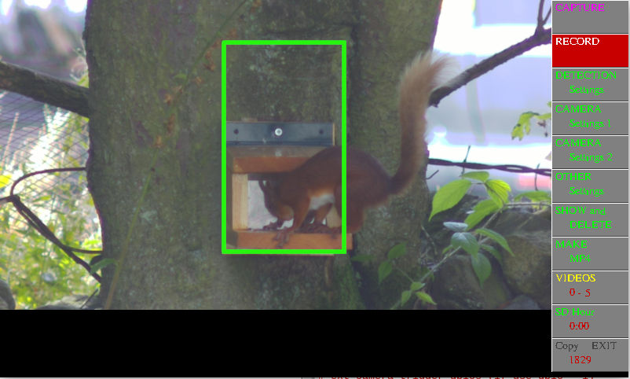

# Pi_Videoer

A python script to capture images either triggered by motion or timelapse. Uses Raspberry OS BULLSEYE and libcamera-vid / still.
It can capture either videos as still frames, upto 30fps at 1920 x 1080, which can be converted into MP4 files, or still photos at full resolution.

Pi4 recommended, which may need a fan for cooling due to high use of cpu.

## Screenshot

To install:

Install latest RaspiOS based on Bullseye (tested with FULL 32bit version)

sudo apt install python3-opencv

Download Pi_Videoer.py and copy to /home/pi (assuming your username is pi)

MAIN MENU

CAPTURE - switch capturing ON / OFF

RECORD  - click to capture a video or still picture

DETECTION SETTINGS - PREVIEW THRESHOLD (Shows detected pixels),Set Thresholds (set Lo Threshold to 0 for Timelapse), Detection levels, Area of detection, Interval (set for Timelapse), Zoom (to help focusssing, shows a focus value.).

CAMERA SETTINGS 1 - Colour filter (R/G/B/FULL), Camera Controls, Video Length

CAMERA SETTINGS 2 - Video Format, Camera Controls

OTHER SETTINGS    - FAN TEMPS (if GPIO enabled), EXT TRIGGER to trigger an external camera (if GPIO enabled)

SHOW & DELETE     - VIDEO (Shows triggered frame), PLAY VIDEO , FRAME (advance by single frames), DELETE FRAME, DEL to END (Deletes from selected frame to end of video), DELETE VIDEO, DELETE ALL VIDS (RIGHT mouse click), SHOW ALL VIDEOS (sequences through all triggered frames)

MAKE MP4  - VIDEO (Shows triggered frame), PLAY VIDEO , FRAME (advance by single frames), DELETE FRAME, DEL to END (Deletes from selected frame to end of video), MAKE A MP4 (makes an mp4 from chosen video), MAKE ALL MP4s (makes seperate MP4s from ALL Videos), MAKE FULL MP4 (Makes a MP4 from ALL Videos), MOVE MP4s to USB (moves MP4s from SD card to USB if installed)

VIDEOS / PICTURES - Choose to capture Videos or Still Pictures, shows number stored in RAM and on SD CARD

SD HOUR - will shutdown at this time. set to 0 to disable.

COPY / EXIT - COPY will copy all stored JPGs (Video and Pictures) to USB. EXIT to exit script.
