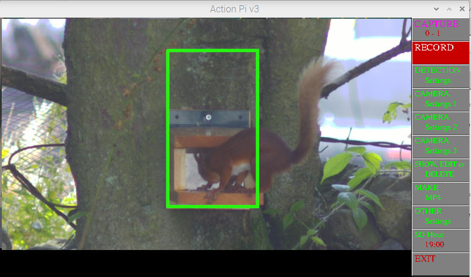
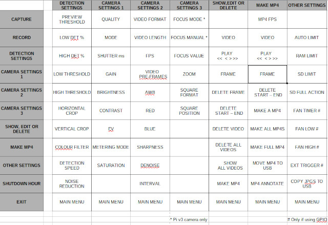

# Pi_Videoer

A python script to capture images triggered by motion , external trigger or manually. Uses Raspberry OS BULLSEYE or BOOKWORM (for BOOKWORM switch to X11 not Wayland) and libcamera-vid.
It will capture videos as still frames, upto 30fps at 1920 x 1080, which can be converted into MP4 files.

lt also captures frames before the trigger frame, default is 2 seconds but user settable.

lt has some editing facilities, delete individual frames, delete a series of frames, delete all frames from start or to end of video,or delete all frames.

Can make individual mp4s, all mp4s  or a FULL MP4 of frames stored.

Can control focus on a pi v3camera, auto, continuous,  manual or spot. For spot click on image when in menu showing focus options.

Frames are captured to /home/《user》/Pictures, mp4s in /home/《user》/Videos.

Pi4 4GB/8GB recommended, with RaspiOS 64bit. You may need a cooling fan. Also 64GB SD card if many videos expected. It can copy to a USB stick if fitted.

## Screenshot

## Menu structure

To install:

Install latest FULL RaspiOS based on Bullseye or Bookworm (tested with FULL 32bit and 64bit versions)

if using BOOKWORM switch to X11. sudo raspi-config, choose advanced , choose 6A X11 option, reboot.

sudo apt install python3-opencv

Download PiVideoer.py and copy to /home/《user》

MAIN MENU

CAPTURE - switch capturing ON / OFF. Shows number of videos in RAM - on SD card

RECORD  - click to capture a video. Shows RAM space left - % of SD card used.

DETECTION SETTINGS - PREVIEW THRESHOLD (Shows detected pixels),Set Thresholds (change in pixel levels), Detection levels (% of changed pixels), Area of detection, Detection Speed (1-100), Colour Filter (R/G/B/FULL), Noise Reduction (OFF/LOW/HIGH).

CAMERA SETTINGS 1 -  Camera Controls

CAMERA SETTINGS 2 - Video Format, Video Length,Video pre-frames, more Camera Controls, Interval (delay before being re-triggered)

CAMERA SETTINGS 3 -  Focus (Manual / Auto for v3 camera),Zoom (to help focusing), Square Format video, SF Position. MASK ALPHA sets mask displayed level. CLEAR MASK sets mask to full ON or OFF (right click).

OTHER SETTINGS    - Auto Time (will copy videos to SD card after this time with no activity), RAM limit (MB),SD Card Limit (%), SD FULL Action, FAN TEMPS (if GPIO enabled), EXT TRIGGER to trigger an external camera (if GPIO enabled), Copy JPGs to USB (shows % of USB used)

SHOW, EDIT & DELETE     - VIDEO (Shows triggered frame), PLAY VIDEO (×4 backwards, backwards,forwards, 4x forwards) , FRAME (advance by single frames), DELETE FRAME, DEL from START /to END , DELETE VIDEO, DELETE ALL VIDS (RIGHT mouse click), SHOW ALL VIDEOS (sequences through all triggered frames), MAKE MP4 menu

MAKE MP4  - Set MP4 FPS, VIDEO (Shows triggered frame), PLAY VIDEO , FRAME (advance by single frames), DELETE FRAME, DEL from START / to END , MAKE A MP4 (makes an mp4 from chosen video), MAKE ALL MP4s (makes seperate MP4s from ALL Videos), MAKE FULL MP4 (Makes a MP4 from ALL Videos), MOVE MP4s to USB (moves MP4s from SD card to USB if installed), MP4 Annotate with date and time

SD HOUR - will shutdown at this time. set to 0 to disable.

EXIT - EXIT to exit script. ALWAYS USE THIS TO EXIT, OR You will need to reboot your pi.

You can mask areas within the defined area of detection. Right click within the area, masked areas will show as dark, click again to clear.
